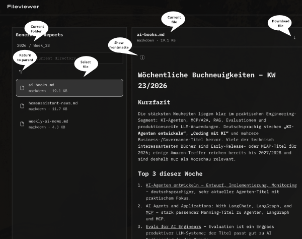

# Hermes Fileviewer Plugin

Read-only dashboard plugin for Hermes Agent. The plugin exposes one configured root directory in the Hermes Dashboard as a safe file viewer and can preview supported document files directly.

Version: `0.1.0`

## Quick introduction

The plugin adds a `Fileviewer` tab to the Hermes Dashboard at `/fileviewer`. It shows exactly one server-side configured root directory and only allows read access.

Supported document types in the MVP:

- Markdown: `.md`, `.markdown`
- HTML: `.html`, `.htm`
- PDF: `.pdf`

HTML files can load relative image assets, for example:

- `.png`
- `.jpg`, `.jpeg`
- `.gif`
- `.webp`
- `.svg`

These image files are not shown as standalone documents in the file list by default, but they are available to HTML previews.

## Installation

Install directly from the repository distribution path:

```bash
hermes plugins install https://github.com/nhranitzky/hermes-fileviewer-plugin/fileviewer
```

The plugin is installed into the active Hermes profile's plugin directory.


## Configuration

The configuration lives under `plugins.fileviewer` in the Hermes configuration.

Example:

```yaml
plugins:
  fileviewer:
    enabled: true
    root: <your-document-root>
    title: Reports
    allowed_extensions:
      - .md
      - .markdown
      - .html
      - .htm
      - .pdf
    hide_hidden: true
    markdown_max_bytes: 5242880
    max_entries_per_directory: 1000
```

Recommended setup via the Hermes CLI:

```bash
hermes config set plugins.fileviewer.enabled true
hermes config set plugins.fileviewer.root <your-document-root>
hermes config set plugins.fileviewer.title Reports
hermes config set plugins.fileviewer.markdown_max_bytes 5242880
hermes config set plugins.fileviewer.max_entries_per_directory 1000
```
 

Configuration fields:

- `enabled`: enables or disables the plugin.
- `root`: absolute path to the root directory. Required when the plugin is enabled.
- `title`: display label for the root directory in the UI. Default: `Root`.
- `allowed_extensions`: allowed document extensions for listing and preview.
- `hide_hidden`: hides hidden files and hidden path segments. In the MVP this should remain `true`.
- `markdown_max_bytes`: maximum Markdown file size for JSON delivery.
- `max_entries_per_directory`: maximum number of visible entries per directory.

## Functionality

### File browser



- Split view with directory list on the left and preview on the right.
- Navigation through relative paths.
- Parent-directory navigation via compact glyph `↰`.
- Download via compact glyph `⤓`.
- Directories are shown without a redundant `directory` subtitle.
- The configured `title` is shown in the left browser panel.
- URL state uses `path` and `file`, enabling deep links.

### Markdown preview

Markdown is delivered by the backend as UTF-8 text and safely rendered client-side. Raw HTML in Markdown is not injected into the React DOM.

Supported:

- Headings
- Paragraphs
- Links
- Inline code
- Code blocks
- Unordered lists
- Ordered lists
- Pipe tables
- Frontmatter detection

YAML frontmatter at the beginning of a Markdown file is hidden from the document body by default. It can be revealed with the `ⓘ` glyph. Simple `key: value` frontmatter is displayed as a compact metadata block.

### HTML preview

HTML is displayed unchanged in a sandboxed iframe. It is not injected into the application DOM.

Security model:

- `sandbox="allow-same-origin"`
- no `allow-scripts`
- no `allow-forms`
- no popups
- restrictive Content-Security-Policy
- server-side root, hidden-path, and symlink checks

HTML previews use a path-shaped raw route:

```text
/api/plugins/fileviewer/raw-path/<relative-file>
```

This allows relative assets such as:

```html

```

to work even behind a dashboard prefix such as `/hermes`.

### PDF preview

PDF files are displayed inline through the browser PDF viewer and can be downloaded.

### Security

The plugin is intentionally restrictive:

- read-only
- exactly one configured root directory
- no uploads
- no deletes
- no renames
- no write operations
- symlinks are not shown and not followed
- hidden files are not shown
- absolute paths from the browser are not accepted
- all paths are normalized server-side and checked against the root
- error responses do not contain absolute server paths or stack traces

Status codes:

- `400`: malformed path, for example a backslash or an absolute path
- `403`: forbidden access, for example hidden path, symlink, or root escape
- `404`: file or directory not found
- `413`: Markdown file too large
- `415`: unsupported file type, or path is not a file/directory as expected
- `422`: Markdown file is not valid UTF-8
- `503`: plugin disabled or invalid configuration

## API endpoints

The API is mounted under `/api/plugins/fileviewer`:

```text
GET /config
GET /list?path=<relative-dir>
GET /markdown?path=<relative-file>
GET /raw?path=<relative-file>&mode=inline|download
GET /raw-path/<relative-file>?mode=inline|download
```

## Development
### Maintenance

```bash
make install   # rsyncs fileviewer/ to PLUGIN_INSTALL_DIR from .env (only for development)
make clean     # removes pytest cache and __pycache__ directories
```

## Tests

Run tests from the project directory:

```bash
uv run --with pytest --with fastapi --with httpx --with pyyaml python -m pytest tests/ -q
node --check fileviewer/dashboard/dist/index.js
```

Current verified state:

```text
27 passed
```

---

Plugin developed in Hermes with GPT-5.5.

## Licence

MIT